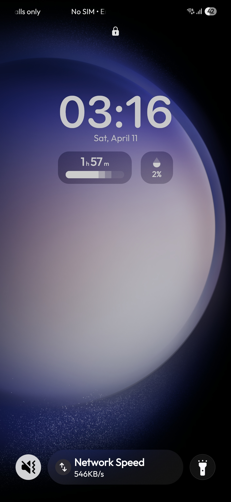
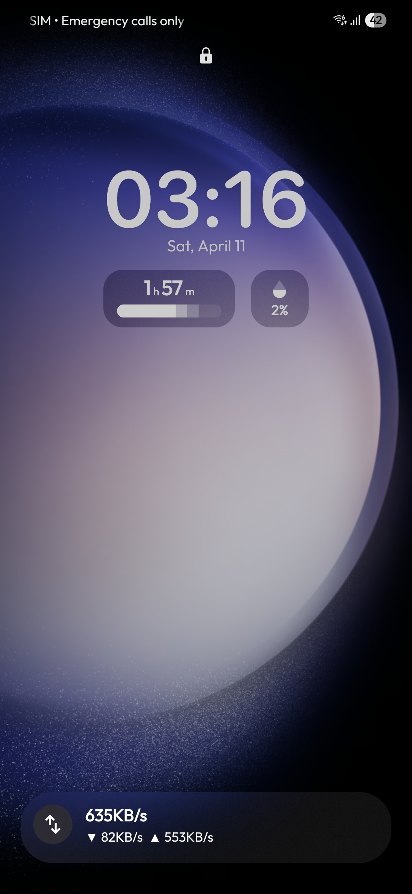

# Nowbar Meter

  

  <strong>Precise internet speed monitor hijacked directly into the Samsung One UI Now Bar.</strong>

    
    
    
    

## About

NowbarMeter is a specialized fork of [Pixel Meter](https://github.com/Mystery00/PixelMeter), rebuilt specifically for Samsung Galaxy devices.

Samsung severely restricted the **Now Bar** (Live Updates / Status Bar Chip) feature in modern One UI builds, locking it behind a hardcoded system whitelist of proprietary and partner apps. **NowbarMeter bypasses this restriction.** By injecting the `com.samsung.android.support.ongoing_activity` metadata flag and strategically spoofing a whitelisted package name (e.g., `com.nhn.android.nmap`), this app forces a native, real-time network speed monitor directly into the One UI Now Bar pill.

It retains all the god-tier features of the original app, including intelligent VPN traffic filtering, so your displayed speed is exactly what your physical interface is actually pulling.

## Screenshots

  
  

 

  
  
<em>Native integration directly into the One UI status bar.</em>

## Installation

Since this app modifies system-level UI elements, it is not available on the Google Play Store.

1. Go to the [Releases Page](https://github.com/realMoai/NowbarMeter/releases/latest).
2. Download the latest `NowbarMeter-vX.X.apk` file under the **Assets** dropdown.
3. Open the APK file to install it.

## Features

- **Samsung Now Bar Native Integration**: Hijacks the One UI status bar chip to display real-time upload and download speeds perfectly native to the system UI.
- **One UI 7 Payload Injection**: Bypasses Android 15's hardcoded signature verification by directly injecting proprietary Samsung metadata and `semFlags` into the notification builder.
- **Lockscreen Override**: Uses system broadcast receivers to force the Live Update chip to render on your secure lockscreen, even if you have it hidden in the regular status bar.
- **Built-In OTA Updater**: Native, zero-dependency integration with the GitHub API that checks for new releases on launch.
- **Whitelist Bypass**: Uses package spoofing (`com.kakao.taxi`) to bypass Samsung's legacy One UI 7+ walled-garden restrictions.
- **Compact Speed Text**: Dynamically drops decimals on higher speeds (>= 10) so the text never cuts off or overflows the status bar icon boundaries.
- **Precise Traffic Stats**: Uses `ConnectivityManager` and `TrafficStats` to filter out `tun0` and virtual VPN interfaces to prevent double-counting data.

## Requirements

- **Device**: Samsung Galaxy devices running One UI 7.0 or higher.
- **Android Version**: Android 12 (API Level 31) or higher.
- **Permissions**: Notification (Crucial for the foreground service to push to the Now Bar) and Battery Optimization bypass.

## Architecture

- **Language**: Kotlin
- **UI Framework**: Jetpack Compose (Material 3)
- **Architecture Pattern**: MVVM + Clean Architecture
- **Dependency Injection**: Koin
- **Data Source**: `TrafficStats` + `ConnectivityManager`

## Credits

Massive shoutout to [Mystery00](https://github.com/Mystery00) for building the original, open-source [Pixel Meter](https://github.com/Mystery00/PixelMeter). This fork simply adapts their brilliant networking logic to break through Samsung's UI restrictions.

## License

This project is licensed under the Apache License 2.0. See the [LICENSE](LICENSE) file for details.